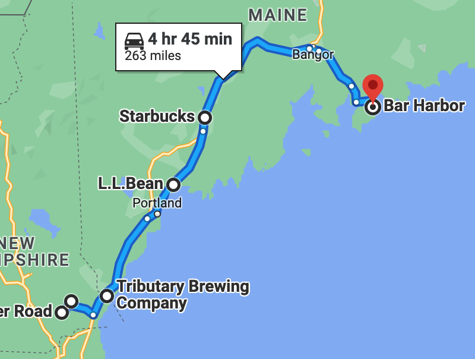

# 🇺🇸 Fremont, NH to Bar Harbor, ME 🦞

####  << Previous Post | [Index](../README.md) | [Next Post >>](06-27.md)

## Today's Trip

**Date:** Sunday, June 26, 2016

**Starting Point:** Fremont, New Hampshire

**Destination:** Bluenose Inn, Bar Harbor, Maine

**Distance:** 263 miles

## The Budget

* $60 daily addition
* -$54.50 expenses
  * $23 - Tributary Beer & Sticker
  * $27 - Campfire grate & camp dessert
  * $4.50 - Starbucks
* End of day total: **$5.50**

## 🥵 😭 🚙 🛒 🍺 ☕ 🏨 🍽 🍸 🎹 😎 💥

## Journal Entry

* Packed up camp in Fremont - sweaty 😅
* Goodbyes 😭
* Drove to Epping
* Grocery shopping, didn't count this towards daily budget.
* Locked up our bikes (this will later bite us in the ass)
* Drove to Kittery
* Beer + sticker from Tributary - $23
* Drove to Freeport - stopped at LLBean and bought grate and camp dessert - $27
* Drove to Augusta - stopped Starbucks for iced coffee - $4.50
* Drove to Bar Harbor - checked in at the Bluenose Hotel
* Walked to downtown Bar Harbor
  * Ate at Café This Way - YUM!
    * Fingerling potato poutine with bourbon gravy
    * Eggplant southwest shepherd's pie - Jay
    * Quail Tikka Masala - Mel
    * Bottle of NZ Sauvignon Blanc
* Walked back to hotel
* Went to "The Great Room"
  * 2x martinis
    * Tanqueray gin
    * elderflower liqueur
    * grapefruit juice
    * grenadine
* Nick the bartender was great + sassy. Gave us free nuts.
* Piano guy was a real showman.
  * Cheesy AF
  * Schmoozer
  * Beatles medley
  * Old people
  * Ancient furniture
  * "America the Beautiful" closer
* Hung out in room 😎
* RIP Scarface 😱

## Trip Statistics

* **Total Distance:** 263 miles
* **Total Budget Spent:** $54.50
* **U.S. States**
  * New Hampshire
  * Maine

####  << Previous Post | [Index](../README.md) | [Next Post >>](06-27.md)
