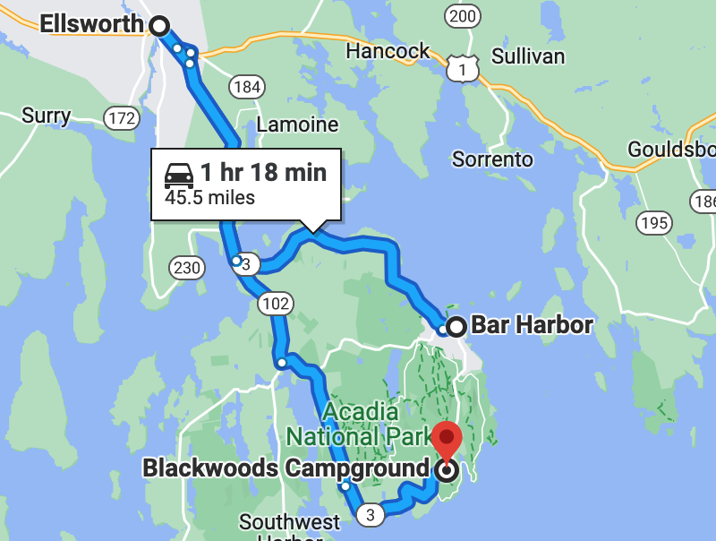

# 🦞 Bar Harbor, ME to Acadia 🌲

####  [<< Previous Post](06-26.md) | [Index](../README.md) | [Next Post >>](06-28.md)

## Today's Trip

**Date:** Monday, June 27, 2016

**Starting Point:** Bluenose Inn, Bar Harbor, ME

**Destination:** Blackwoods Campground, Acadia National Park, ME

**Distance:** 69 miles

**Photos:** [June 27 Photos](https://jay-d.me/2016RT-06-27)

##  🏨 🥞 🌲 🏕 🚙 🛒 🔥 🍻 🤘 🍔

## Journal Entry

* Checked out of hotel - glass elevator
* Walked to downtown Bar Harbor for breakfast @ Jeannie's
* Walked back
* Drove to Acadia - $45 (no 1/2 price for camping)
* Set up camp and trailer
* Drove to Ellsworth
* Went to Tractor Supply Company and Marden's, nothing good.
* Reny's - $91.68, basics that we should have had already. Not counted in the budget.
  * Camp stove - $40
  * Hat for Mel - $20
  * Bluetooth speaker - $20
  * Soap + toothbrush holder - $1
  * Rubber mallet - $3
  * Egg container - $3
  * Propane - $4
  * Clothespins - $1
* Walmart - $8.24
  * Ice - $3
  * Seam seal - $5
* Wood - $10
* Return to camp
* Start fire
* Snacks and Tributary beer
* New speakers are swish 🤘
* Dinner
  * Veggie burgers with cheese
    * Boca Roasted Vegetable
    * Yum!
  * Betty Crocker instant potatoes
    * Could be good
    * Cilantro oil was too flowery
  * Pickles
* Dishes
  * Sinks are great
  * Mel wet her pants
* Bedtime
  * Asthma (sucks...)
      * Claratin + nose steroids + solitaire

## The Budget

* $5.50 from previous day
* $60.00 daily addition
* -$63.00 expenses
  * $45.00 - Campground
  * $10.00 - Wood
  * $8.00 - Ice & Seam Seal
* End of day total: **$2.50**

## Trip Statistics

* **Total Distance:** 254 miles
* **Total Budget Spent:** $117.50
* **U.S. States**
  * New Hampshire
  * Maine

####  [<< Previous Post](06-26.md) | [Index](../README.md) | [Next Post >>](06-28.md)
