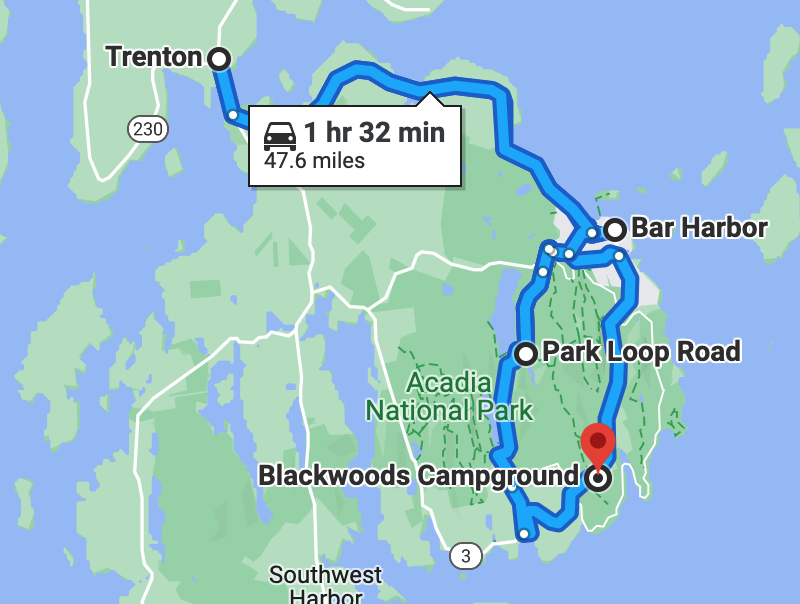
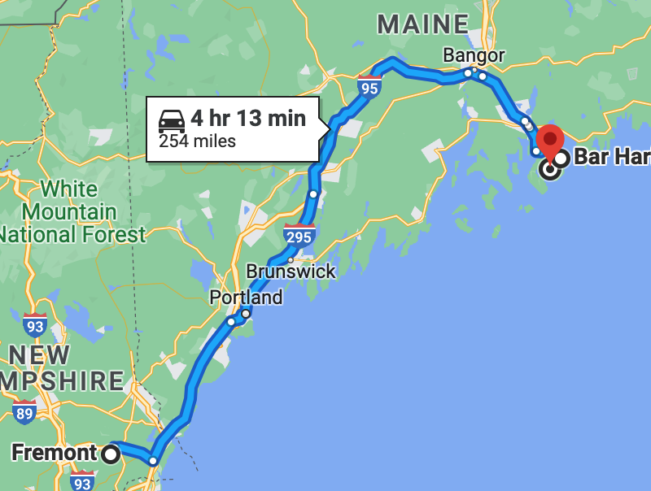

# 6/28 - Acadia

## 🌊🌊🌲🌲🌲___ 🚲_ 🚲___

---
**Starting Point:** Blackwoods Campground, Acadia National Park, ME

**Destination:** Blackwoods Campground, Acadia National Park, ME

**Distance:** 49 Miles

**Budget:** $30

---

---

### Journal Entry

* Woke up - made coffee with JetBoil
  * 2 pots
* Fought with the u-lock 🤜 🔐
  * Intense battle 💥
  * Fears of having to find a locksmith
  * 🏆 VICTORY was ours... eventually 🔓
* Celebratory Kalulah Coffee
* Breakfast
  * PB+J + cheese squares (Cabot plaid)
* 🐿 Red squirrel in the wheel well
* Met old neighbors from Salem, MA. They left
* Rode bikes to check out the weather. Decided to bike today
* Rode 17 miles on the Park Loop Rd
  * Tough start on the Carriageway
  * Pretty landscapes
  * Lots of photos on the camera
  * Mel can climb for days
* Quick shower
* Mac & Cheese and seltzer for lunch
* Drove to Bar Harbor
  * Found Jesup library - free wifi!
  * Paid a bill
  * Figured out Nova Scotia lodging
* Drove to Trenton for phone calls and booking
* Grocery shopping at the IGA - $28
  * Bell pepper
  * Lime
  * 2 ears of corn
  * Olive oil
  * Butter
  * 1/2 dozen eggs
  * Whiskey
  * Ginger ale
* Back to camp for dinner
  * Grilled the corn on the fire 🌽 🔥
  * Veggie burrito
    * Rice
    * Pepper
    * Beans
    * Cheese
  * Tortilla on fire?
* Met new neighbors: Todd, Becky + Sadie (Brain) from Plymouth, originally from Westboro
* Charged Duracell batter in the bathroom
* Prepped for rain... a bit. Left clothes on the line attached to tent and left floor mat out.
  * Mat is dirty as hell
* Lots of rain overnight

---

### Things to do in town
* [X] Text Andrew, ask about getting our old weather gauge from the Watertown apartment porch
* [X] Figure out itinerary through New Brunswick and start of Nova Scotia
* [ ] Mail RCN gear
    * [X] Print shipping label
* [ ] Call Masshealth
    * [ ] Confirm statement of income receipt
    * [ ] Ask about COBRA primary

---

### Total Trip to Date

