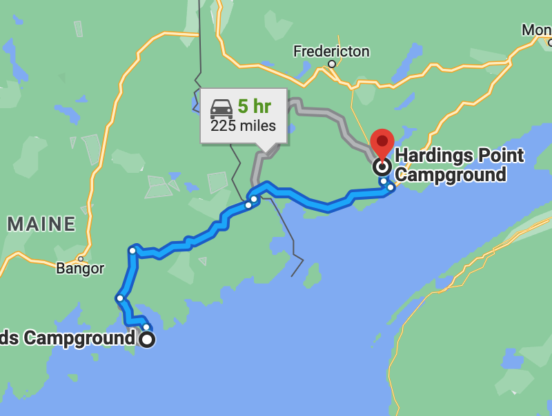

# 6/30 - Acadia to Harding's Point, NB

## 🇨🇦 🦫 🌲 🦫 🇨🇦

---
**Starting Point:** Blackwoods Campground, Acadia National Park, ME

**Destination:** Harding's Point Campground, New Brunswick, Canada

**Distance:** 225 Miles

**Total Trip Distance:** 454 miles

**Budget:** $30

---

---

### Journal Entry

* Packed up camp at Acadia
* Made breakfast
  * Eggs, toast + coffee
  * Took a long time! 3 hours (including breakfast)
* Drove to the Jesup library in Bar Harbor
  * Confirmed plans for Friday @ The Shire
  * Got information on RCN mailing
* Drove to Ellsworth
  * Called Masshealth. It took *forever*.  Changed our address.
  * Heard from SandyMom, Waldo is doing better.
* Drove to CANADA! 🇨🇦
  * We were detained! They were confused when we told them we had no cash. Jay didn't realize they meant bank accounts.
  * All good, yo.
* Entered into New Brunswick!
* Drove to St. John / Harding's Point Campground.
  * We had to take a short (3 min) ferry across the St. John river to get to our campground.
    * The line was **LONG**.
    * Lots of bottoming out.
    * Met our first Canadian. He works at Irving and takes the ferry *every* day.
* We set up at the campground.
  * It was a beautiful, private site, right on the marsh/river. Complete with a babbling brook!
  * Bathrooms were quite far from our site.
  * There was a beaver-watching area!
  * It was a *HUGE* campground, ~150 sites.
  * There was a neat pull-stop sign that was manned. Everyone was quite nice.
* After setting up, we needed some food so we drove to Soobey's. We had to take the ferry back over the river.
* The grocery store was **SO EXPENSIVE** and all the produce was horrible. We had wanted a salad...
* We popped into a liquor store for beer. Also *SO* expensive. A 6-pack of IPA was $14!
* Took the ferry back over the river to our campsite.
* Had caprese salad sammies + salad for dinner.
* The site was so buggy that we went insane 🤪.
* We cooked food on the propane stove + ate inside. Then we passed out!

---

### Total Trip to Date

**Distance:** 454 miles

