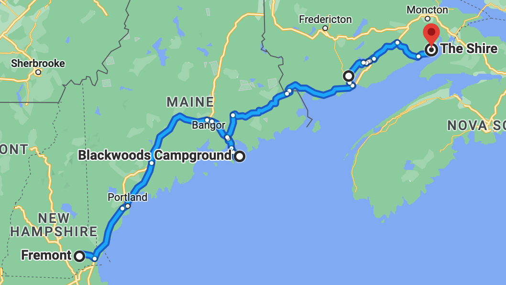

# 7/01 - Harding's Point, NB to The Shire

## 🦟🦟🦟

---
**Starting Point:** Harding's Point Campground, New Brunswick, Canada

**Destination:** The Shire, New Horton, New Brunswick, Canada 

**Distance:** 139 Miles

**Total Trip Distance:** 557 miles

**Budget:** ? 

---

---

### Journal Entry

* Showered! $0.25/3.5 minutes. It was a little confusing and a long walk, but it felt good to be clean. Jay's shower was but a trickle. 😕
  * Jay: first shower since Sunday evening
  * Mel: first shower since Monday morning
* Ate eggs + mushies + peps + *BEER*.
* Packed up camp. It was **WARM**. 🥵
* We left the campsite on the ferry, thinking we had made the strict 11am checkout time. We realized a short while later that we had been living an hour behind. Apparently, New Brunswick and Nova Scotia are an hour ahead of Boston! LOLOLOLOL 😂
* We then drove to downtown St. John. It was crazy busy with activities. That's when we realized it was Canada day! We ditched downtown because there was nowhere to park. 
* Checked out the Reversing Falls/Rapids. It was slack tide, so it was fairly calm.
  * 200' underwater waterfall!
  * 14' difference between the St. John river and the Bay of Fundy. This is what causes the Falls/Rapids.
  * $6.50
* Went to Tim's (aka Tim Hortons) for the first time.
  * Got an ice cap (iced cappuccino). #SoCanada. It was basically a coffee coolata. They made Jay's belly hurt. 😖
  * Charged our laptop and phones.
  * Booked lodging for Sunday through Wednesday @ Valley View park.
  * Got directions, etc.
* Left St. John, stopped at an Irving Big Stop for gas. Card struggles.
* Stopped at the Fundy overlook. Our first glimpse!
* Drove to The Shire (**free!** camping in New Horton).
* We set up camp and were immediately confronted by a woman whose Scottish husband was passed out on a bench swing. She asked if we were the owners or something. So weird.
* Me Don, the owner, who popped over on his 4-wheeler. He's a great guy who loves meeting people.
* Met Bob Smith, a guy from Hillsborough who was staying at The Shire with his wife, Patty, in a camper. They were fishing with their friends, including the drunk Scot.
* The Shire had a wood burning pizza oven! Free wood, a fire pit, a garden and a tin man.
* We met Justin (Quebec) and Amara (Saskatchewan / Nova Scotia), a hippy-ish couple.
* Took a trip to the general store for more beer and a frozen pizza. $23
  *  We cooked the frozen pizza in the wood-burning pizza oven. It was not very effective. 🔥🍕
* Hung out and drank beers and some of Bob's homemade hooch.
* The weird girl (Scotch daughter) wanted to play a CSI board game. No one else did.
* We learned how to play washer toss, which is basically Canadian corn hole.
* Met and hung out with Don's friends from down the street: Jacques and his wife. They've travelled a lot! Jacques is a professor.
* We met Jordan, the leader of a church group from Saskatchewan.
* Hung out by the fire drinking beer and hooch.
  * Tried Moose Light beer!
  * Hung out with Patty, Bob, Justin, Jordan, Georgina
* Passed out. 😴💤
* 🌙
* **HOLY FUCK MOSQUITOES EVERYWHERE!**
* 🦟🦟🦟🦟🦟🦟🦟🦟🦟🦟🦟🦟🦟🦟🦟🦟🦟

---

### Total Trip to Date

**Distance:** 557 miles

