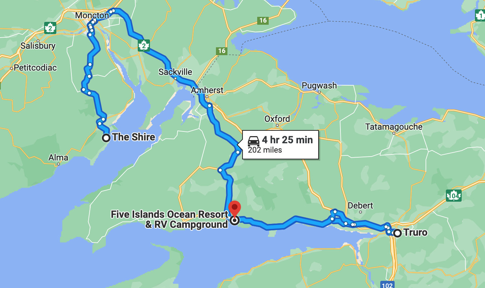

# 🦟 The Shire to Five Islands 🏝

#### [<< Previous Post](07-01.md) | [Index](../README.md) | [Next Post >>](07-03.md)

## Today's Trip

**Date:** Saturday, July 2, 2016

**Starting Point:** The Shire, New Horton, New Brunswick, Canada

**Destination:** Five Islands Resort & RV Park, Nova Scotia, Canada

**Distance:** 202 miles

**Photos:** [July 02 Photos](https://jay-d.me/2016RT-07-02)

## 🦟🦟🦟🦟 🩸 🤕 🌧 💨 🏝🏝🏝🏝🏝 💨🧦🩳

## Journal Entry

* Woke up at ~5 AM to FUCKING MOSQUITO HELL! Pure carnage. Blood everywhere. Bug corpses littered the camper. There was blood on our clothes. Gross.
* Jay was also horrible hungover from the hooch.
* The mosquitoes were finally driven out when it started pouring... Not ideal for packing up.
* We packed up our wet stuff after a little more sleep and GTFO'd after a few quick goodbyes.
* Stopped at Hopewell Rocks, but admission was $10 each, and it was high tide. A sign told us low tide was better for viewing. We decided we might try again when leaving Nova Scotia.
* We stopped at an Irving to pee.
* Drove to downtown Moncton. Got some breakfast sammies + cappuccinos with a gift card to Starbucks.
* Welcome to Nova Scotia!!!
* The Welcome Center was super windy (there was a wind farm), but it was really nice. The bathrooms were super clean. There was lots of helpful information and also a weird, ferret-like velociraptor statue. 🦖
* Drove to the campground at Five Islands. Super nice people! Stunning vista. Great views of the five islands. We found a nice spot under a tree. Did some laundry but the dryer shut off before the laundry was dry.
* We then went to Truro to get some supplies. We went grocery shopping at Soobey's and found a life-changing, battery-powered mattress pump at Walmart ($35).
* We also picked up some Canadian cash ($30).
* On the way back to the campsite, we picked up two bags of wood from a road-side stand ($6).
* When we got back to our campsite, the laundry still wasn't dry. We hung it up all around the tent using the lines for the awning.
* Made dinner: mango jalapeno chicken sausages with baked beans. Yum!
* Sleep.

## The Budget

* $87.00 from previous day
* $60.00 daily addition
* -102.00$ expenses
  * Campground - $31.00
  * Groceries - $35.00
  * Walmart Run - $30.00
  * Wood - $6.00
* End of day total: **$45.00**

## Trip Statistics

* **Total Distance:** 986 miles
* **Total Budget Spent:** $375.00
* **U.S. States**
    * New Hampshire
    * Maine
* **Canadian Provinces**
    * New Brunswick
    * Nova Scotia
* **National Parks**
    * Acadia

#### [<< Previous Post](07-01.md) | [Index](../README.md) | [Next Post >>](07-03.md)
