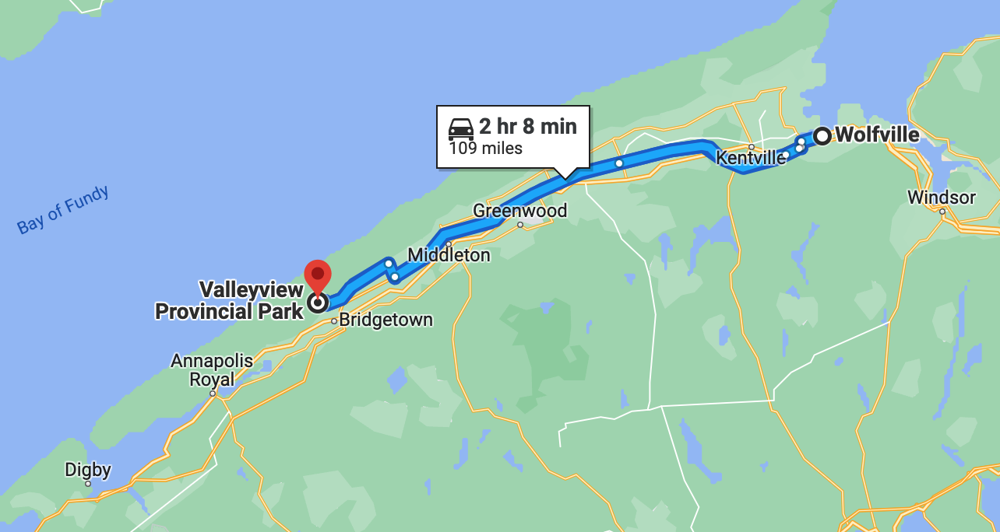

# 🖼 Valley View 🖼

#### [<< Previous Post](07-04.md) | [Index](../README.md) | [Next Post >>](07-06.md)

## Today's Trip

**Date:** Tuesday, July 05, 2016

**Starting Point:** Valley View Provincial Park, Hampton, Nova Scotia, Canada

**Destination:** Valley View Provincial Park, Hampton, Nova Scotia, Canada

**Distance:** 109 miles

**Photos:** [07/05 Photos](https://jay-d.me/2016RT-07-05)

##  ☕️🐛 🚙 🐺🌆 🚲🚲 🍷🍷🍷🍎🍺 🐶🐶 🍎 💨🛏

## Journal Entry

* Woke up. Eggs, peppers, onions, coffee. Bug in Mel's coffee. 🤢
* Packed up lunch and the car for a day of biking around vineyards in Wolfville. We drove the speed limit this time, ignoring the tailgaters. They were just as crazy this time, even a giant truck hauling logs was riding our butts.
* In Wolfville, we found some all-day parking and hopped on our bikes.
* Our first stop was Domaine de Grand Pre. Mel's favorite was the Tiday Bay, a Nova Scotia regional, and Jay's was the Apple Cream Liqueur
* Climbed a giant freaking hill up to the Luckett winery. They had an **amazing** view all the way out to Blomidon. Mel's favorite was the Tiday Bay (?) and Jay's was the rosette.
* Descended that giant freaking hill (whee!!!) and rode to L'Acadie. They specialize in bubblies and are 100% organic. The guy was very nice. He told us that it was a very young vineyard compared to others in the area. Mel's favorite from the tasting was the sparkling rose and Jay's was all of them. We then ordered a pour and ate our sandwiches (pb&f) out on the deck.
* We left for the brewery in Port Williams, but on the way we saw the Annapolis Cider Company and decided to stop in. They had corn nuts and large pours (5oz) in their taster flight. The rhubarb and ginger cider was the best. Yum!
* On our way to the brewery, we got caught in a rainstorm and had to take cover under a tree.
* The brewery was kind of weird. Their tastings were in the restaurant next door. It was kind of boring and their beers were a bit flat. The pale ale was okay.
* We tried to find a distillery nearby, but we were unable to locate it. We had probably sampled enough at this point anyway. We took our bikes back to Wolfville.
* We dropped off our bikes at the car and headed back the cider company on foot. We bought a bottle of the rhubarb and ginger cider and headed back to the car.
* Once in the car, we drove to Luckett to buy a bottle of their Tidal Bay, as it was Mel's favorite of the day and Jay really enjoyed it as well.
* We gassed up the car and drove back to camp. Mel got very sleepy.
* Back at camp, Mel was super sleepy. While Jay cleaned up the bikes, like a champ, she took a nap in the hammock, like a lazy butt.
* We met our new neighbors! Jason, Isaac and Barbie are all super nice. They have two Bernese Mountain dogs named Ruby and Nala. We got a few great recommendations from them on places to visit over the next few days.
* Sat and relaxed while enjoying our cider.
* We then spent some time patching up our air mattress. It worked! It was tedious but teamwork made the dream work.

## The Budget

* 52.00 from previous day
* $60 daily addition
* -$152.00 expenses
  * $41.00 - Gas
  * $32.00 - Luckett Vineyards
  * $23.00 - Campsite
  * $21.50 - Annapolis Cider Co.
  * $18.00 - L'Acadie Vineyards
  * $10.00 - Domain de Grand Pre Vineyards
  * $6.50 - Sea Level Brewing
* End of day total: **-$40.00**

## Trip Statistics

* **Total Distance:** 1317 miles
* **Total Budget Spent:** $664.50 
* **U.S. States**
  * New Hampshire
  * Maine
* **Canadian Provinces**
  * New Brunswick
  * Nova Scotia
* **National Parks**
  * Acadia

#### [<< Previous Post](07-04.md) | [Index](../README.md) | [Next Post >>](07-06.md)
