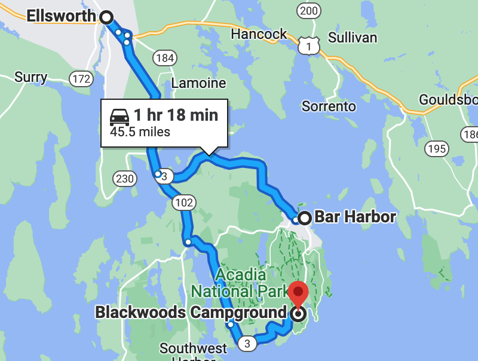

## 6/27 - Bar Harbor, ME to Acadia

---

#### Distance: 264 Miles

#### Budget: $-1

---

---

* Checked out of hotel - glass elevator
* Walked to downtown Bar Harbor for breakfast @ Jeannie's
* Walked back
* Drove to Acadia - $45 (no 1/2 price for camping)
* Set up camp and trailer
* Drove to Ellsworth
* Went to Tractor Supply Company and Marden's, nothing good.
* Reny's - $91.68
  * Campstove - $40
  * Hat for Mel - $20
  * Bluetooth speaker - $20
  * Soap + toothbrush holder - $1
  * Rubber mallet - $3
  * Egg container - $3
  * Propane - $4
  * Clothespins - $1
* Walmart - $8.24
  * Ice - $3
  * Seam seal - $4
* Wood - $10
* Return to camp
* Start fire
* Snacks and Tributary beer
* New speakers are swish 🤘
* Dinner
  * Veggie burgers with cheese
    * Boca Roasted Vegetable
    * Yum!
  * Betty Crocker instant potatoes
    * Could be good
    * Cilantro oil was too flowery
  * Pickles
* Dishes
  * Sinks are great
  * Mel wet her pants
* Bedtime
  * Asthma (sucks...)
      * Claratin + nose roids + solitaire