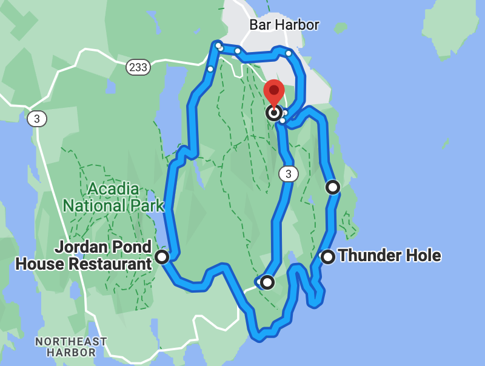

# 🌲 Acadia 🌲

####  [<< Previous Post](https://jay-d.me/2016RT-06-28) | [Index](https://jay-d.me/2016RT) | [Next Post >>](https://jay-d.me/2016RT-06-30)

## Today's Trip

**Date:** Wednesday, June 29, 2016

**Starting Point:** Blackwoods Campground, Acadia National Park, ME

**Destination:** Blackwoods Campground, Acadia National Park, ME

**Distance:** 39 miles

**Photos:** [June 29 Photos](https://jay-d.me/2016RT-06-29)

##  ☕️ ⬜️ 🕳⚡️ 🛶 ⛲️ 🍔 😴 🔋 🫧🕳 🚶🏻‍♀️🚶🏻 🍝 🦟

## Journal Entry

* Emptied rain pockets where water collected in the awning. Adjusted the awning a bit to prevent more puddling.
* Made breakfast.
  * Coffee - 1 pot
  * Scrambled eggs + leftover red bell pepper from last night
  * Bread + peanut butter
  * Cheese stick
* Washed dishes.
* Got things a bit organized - hung up clothes on drying rack.
* Drove around the park.
  * FOGGY. ~~No vistas~~. Beautiful, white vistas. ⬜️
  * Experienced the THUNDER HOLE.
    * ... it was pretty thundery
    * ... it hit max thunder, so we left
  * Jordan Pond boathouse + gift shop
    * Couldn't afford world-famous popovers + strawberry jam 😭
    * Purchased Acadia sticker for the trailer
  * Acadia Gardens and Nature Center
    * Got very wet
    * Cool biomes
    * Sad nature center - we're melting 🫠
* Lunch!
  * Boca burgers with hummus, pickles
  * Leftover rice and beans
  * Seltzer
* NAP! (Big)
  * Pretty solid nap. We were ready for max-thunder hole
* Charged Duracell thing again in bathroom.
* Went *back* to the Thunder Hole expecting much thunder, but it was only a weak gurgle hole.
* Came back to campground a new way through the park.
* Tidied up to prep for departure.
* Checked around for free wood - no dice 😕
* Checked out the amphitheatre - cool!
* Walked around the grounds to scope/creep on other camp sites.
* Cleaned up lunch dishes.
* Snacks - pita/pretzel chips + hummus.
* Made dinner.
  * Pasta with butter, fresh garlic, olive oil, Parmesan cheese, crushed red pepper, black pepper
  * Whiskey drinks... whiskey + Kahlua drinks?
* Did dishes.
* Lots of mosquitoes!
* No fire (out of wood)

## The Budget

* $34.50 from previous day
* $60.00 daily addition
* $0.00 expenses
* End of day total: **$94.50**

## Trip Statistics

**Total Distance:** 420 miles 🥦
* **Total Budget Spent:** $145.50
* **U.S. States**
  * New Hampshire
  * Maine
* **National Parks**
  * Acadia

####  [<< Previous Post](https://jay-d.me/2016RT-06-28) | [Index](https://jay-d.me/2016RT) | [Next Post >>](https://jay-d.me/2016RT-06-30)
