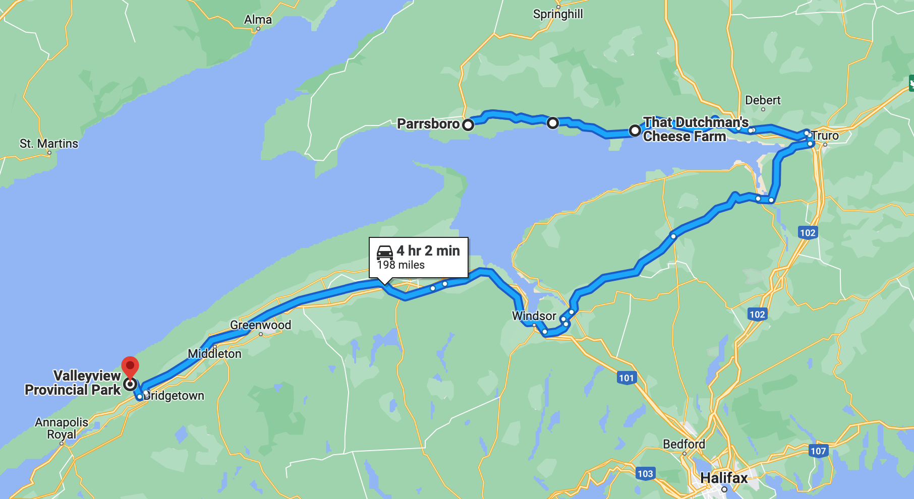

# 🏝 Five Islands to Valley View  🖼 

####  [<< Previous Post](https://jay-d.me/2016RT-07-02) | [Index](https://jay-d.me/2016RT) | [Next Post >>](https://jay-d.me/2016RT-07-04)

## Today's Trip

**Date:** Sunday, July 3, 2016

**Starting Point:** Five Islands Resort & RV Park, Lower Five Islands, Nova Scotia, Canada

**Destination:** Valley View Provincial Park, Hampton, Nova Scotia, Canada

**Distance:** 198 miles

**Photos:** [July 03 Photos](https://jay-d.me/2016RT-07-03-photos)

##  🏝🏝🏝🏝🏝 💨 ⛽️ 🐟 👨🏼‍🌾🧀 🚙😑 ⛺️ 🖼 🚫🔥 🚫💧⁉️ 

## Journal Entry

* Breakfast: black coffee, yogurt + cocoa / coconut granola
* Went for a walk closer to the shore to check out the Five Islands.
* Then we broke down camp. SO WINDY. 💨
* We drove to Parrsboro for gas. It's a super cute town.
* We then got headed in the right direction and went to the fish market across from the campground. We got a great deal on fish! Bought a pound of haddock and a bag of ice for $8!
* Our next stop was That Dutchman's Cheese Farm. It was a cool farm up on a hill with lots of animals to see and hang out with. Great views! We tried many kinds of gouda! **TASTY.**
  * Mel's favorite: Jalapeno and Medium Gouda
  * Jay's Favorite: Really Old Growler + Cumin
  * Bought a brick of medium and some spreadable jalapeno for $13.
* Tried to stop at a bike store in Truro, but it was closed.
* After Truro, we started on the long leg of the journey to Valley View Provincial Park in Bridgetown. It was a boring drive. There weren't many cool license plates and there were lots of tailgaters. The radio DJ was weird: he was very excited about a power outage.
* We got to our campsite ($23). It was super quiet. The front office had Wi-Fi! They also delivered wood! Unfortunately, because of the holiday weekend there was no booze allowed until July 5th.
* We set up camp, including our hammocks for the first time! Awesome sauce. We hung our (still) damp laundry on a laundry line.
* We found two ticks! 😬
* Later, we went for a walk to the scenic "look off" to view the valley. Then we walked around the campground and park.
* Our site is on the top of the hill, near the camp manager, but all the other campers are hanging out in their cars. ☹️
* Hung out for a bit. Journaled. Started a fire and started prepping dinner, but the camp manager came by and told us we couldn't have a fire because of the dry conditions and high winds. We added a few more pieces of wood to the fire, so we could quickly cook our meal, and then we doused it.
* Dinner: foil packets with haddock, zucchini, onion, purple potatoes, lemon, garlic, summer seasoning (Thanks Patty Smith!), butter, etc. It was **DELISH!!!**.
* Cleaned up. Boiled H2O because there was a boil water order! 😐

## The Budget

* $45.00 from previous day
* $60.00 daily addition
* -$85.50 expenses
  * $41.00 - Gas
  * $23.00 - Campsite
  * $13.00 - Cheese
  * $8.50 - Fish & Ice
* End of day total: **$19.50**

## Trip Statistics

* **Total Distance:** 1184 miles
* **Total Budget Spent:** $460.50
* **U.S. States**
  * New Hampshire
  * Maine
* **Canadian Provinces**
  * New Brunswick
  * Nova Scotia
* **National Parks**
  * Acadia

####  [<< Previous Post](https://jay-d.me/2016RT-07-02) | [Index](https://jay-d.me/2016RT) | [Next Post >>](https://jay-d.me/2016RT-07-04)
