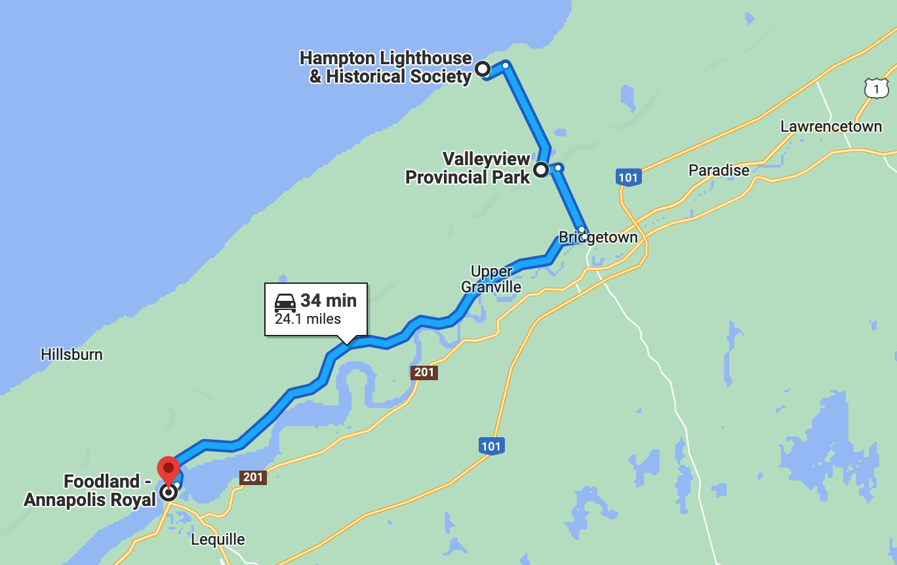

# 🖼 Valley View 🖼

####  [<< Previous Post](https://jay-d.me/2016RT-07-03) | [Index](https://jay-d.me/2016RT) | [Next Post >>](https://jay-d.me/2016RT-07-05)

## Today's Trip

**Date:** Monday, July 04, 2016

**Starting Point:** Valley View Provincial Park, Hampton, Nova Scotia, Canada

**Destination:** Valley View Provincial Park, Hampton, Nova Scotia, Canada

**Distance:** 24 miles

**Photos:** [07/04 Photos](https://jay-d.me/2016RT-07-04)

##  🇺🇸 💤 ☕ 📉️ 🚴🏻‍♀️🚴🏼 🏖🛥 ⛰🚴🏻‍♀️🚴🏼 🌊 🌯

## Journal Entry

* 🇺🇸🇺🇸🇺🇸 USA! USA! USA! 🇺🇸🇺🇸🇺🇸
* It's the fourth of july! 🎆🎆🎆
* Slept in! Woo! Until 10! It's so quiet and peaceful here.
* Had coffee (black again, yum), yogurt and granola.
* Did budget stuff.
* Walked down to the administration building for some internet access. We looked up some stuff to see on our bikes and made contact with home. Mel met the friendly admin guy, who we chatted with for a while.
* We went for a bike ride down to the Hampton Lighthouse. It was so cute and so small! We walked up to the top to check out the view of Fundy.
* There were a few boats in the small harbor, which gave us a chance to see the waterline difference where the tide comes in and out. The boats just sit on the ground when the tide goes out.
* We sat on the beach for a while and ate peanut butter and fluff sandwiches that we had brought.
* Then we rode our bikes back to camp. PHEW, it was hard (that's what she said) because it was all uphill (~1000 feet). We got 9th overall on Strava!
* Took a "shower" and then we drove to Annapolis Royal, a small town that was about 15 minutes away. It was so cute! There was a boat named Melanie Lynn! There was also a cute, small pub that we wanted to check out, but we refrained to save money. The town was SO sleepy and quiet.
* We picked up some corn, a bell pepper and some seltzer at the Foodland in Annapolis Royal ($4.50).
* Unsweetened seltzer was surprisingly hard to find.
* Drove back to camp. We had some seltzer and snacks (hummus and veggies). The birds sounded like Homer Simpson! 🐥
* We then drove *back* to Hampton Beach to check out the tide difference since our last visit. Crazy!
* Jay really loved all the rocks on the beach. So diverse!
* On return, we visited the admin building for a bit more internet.
* Camp again. Relaxed for a bit and then we made yummy corn, pepper, onion, rice and bean burritos. We used some of the jalapeno cheese spread from That Dutchman. Mexican food, in Canada, on the fourth of July!
* Prepared camp for the night, cleaned up some dishes and then it was bedtime!

## The Budget

* $19.50 from previous day
* $60 daily addition
* -$27.50 expenses
  * $23.00 - Campsite
  * $4.50 - Groceries
* End of day total: **52.00**

## Trip Statistics

* **Total Distance:** 1208 miles
* **Total Budget Spent:** $512.50 
* **U.S. States**
  * New Hampshire
  * Maine
* **Canadian Provinces**
  * New Brunswick
  * Nova Scotia
* **National Parks**
  * Acadia

####  [<< Previous Post](https://jay-d.me/2016RT-07-03) | [Index](https://jay-d.me/2016RT) | [Next Post >>](https://jay-d.me/2016RT-07-05)
