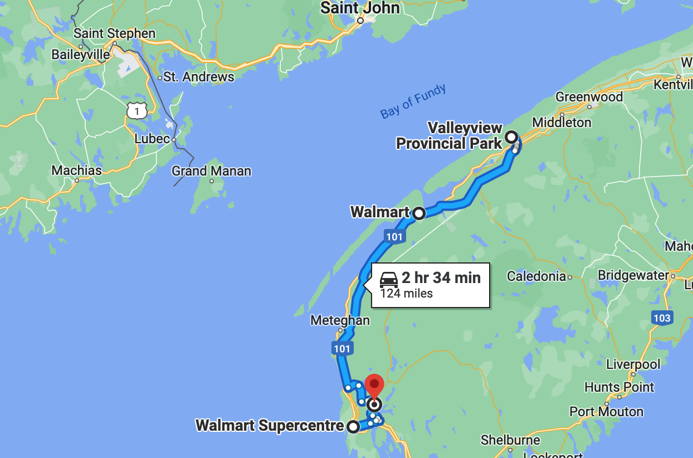
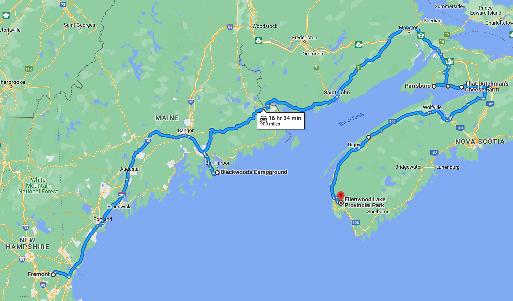

# 🖼  Valley View to Ellenwood Lake 🐥

####  [<< Previous Post](https://jay-d.me/2016RT-07-05) | [Index](https://jay-d.me/2016RT) | [Next Post >>](https://jay-d.me/2016RT-07-07)

## Today's Trip

**Date:** Wednesday, July 06, 2016

**Starting Point:** Valley View Provincial Park, Hampton, Nova Scotia, Canada

**Destination:** Ellenwood Lake Provincial Park, Yarmouth, Nova Scotia, Canada

**Distance:** 125 miles

**Photos:** [07/06 Photos](https://jay-d.me/2016RT-07-06-photos)

##  `EmojiStory`

## 👋🖼  🚙  🛒  ⛺️💥🤬  🚺 👉🍑 👃💧 🍷 🛏 🤫  

* Packed up camp at Valley View and said goodbye to our awesome neighbors. Camp host also came by to say hello and to recommend Kejimkujik Park.
* Drove to Digby. Stopped at a Walmart to buy propane, tin foil, mosquito coil things and dish soap.
* Went into Atlantic Superstore for some rood restocking (dinner supplies) and ice. Seemed cheaper than Sobey's and had fresh fish. The produce looked much better!
* Drove to Ellenwood Lake Provincial Park. It was a short, hour and a half drive from Valley View. They had plenty of sites open, so we picked on that was a good site and had a path down to the lake!
* People are a bit weird here. They don't wave as much. Our site is close to a path that takes you to a "comfort station" that has a flushing toilet and **SHOWERS**!
* We ate some salads that we got at Atlantic Superstore for lunch. They were very tasty, and it felt good to eat some veggies.
* After lunch, we set up camp, but the ground was super hard. We broke our stakes. Jay was super frustrated 🤬 but we took hot **SHOWERS** and felt much better. It was our first shower since last Friday.
* The women's bathroom here is filled with crazy families. It's always really loud. Finger in butts 👉🍑. "This water **STINKS**!" yelled a deranged old woman who was showering with her grandchildren.
* After showers, we drove to Walmart in Yarmouth to get more stakes for the tarp. We also sat in the parking lot for a while and used the Wi-Fi to send some emails and catch up on a few things.
* Back at camp, we fixed the tamp and relaxed for a bit before dinner. Then, we prepped food. Jay set up the hammock again.
* For dinner, we had tilapia filets in foil packets with pesto and lemon (yum!) with rice sides. We also enjoyed our bottle of Tidal Bay wine from Luckett Vineyards. Tidal Bay pairs exceptionally well with seafood. Who would have guessed!
* After dinner, we had some more time to relax with wine before cleaning up and heading to bed.
* At 4AM, halfway across the fucking campground, some hicks started screaming at their kids. Weird. Fishing hicks perhaps?

## The Budget

* $-63.50 from previous day
* $60.00 daily addition
* $75.50 expenses
  * $27.00	Groceries
  * $27.00	Campsite
  * $19.00	Camp Supplies
  * $2.50	Camp Supplies
* End of day total: **$-79.00**

## Trip Statistics

* **Total Distance:** 1419 miles
* **Total Budget Spent:** $739.00
* **U.S. States**
  * New Hampshire
  * Maine
* **Canadian Provinces**
  * Nova Scotia
* **National Parks**
  * Acadia

####  [<< Previous Post](https://jay-d.me/2016RT-07-05) | [Index](https://jay-d.me/2016RT) | [Next Post >>](https://jay-d.me/2016RT-07-07)
