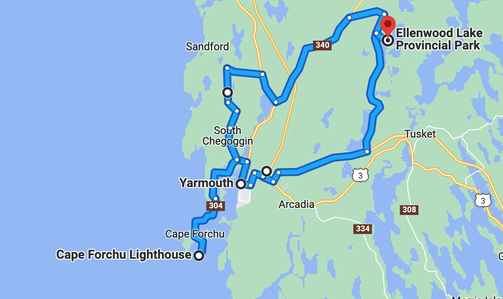
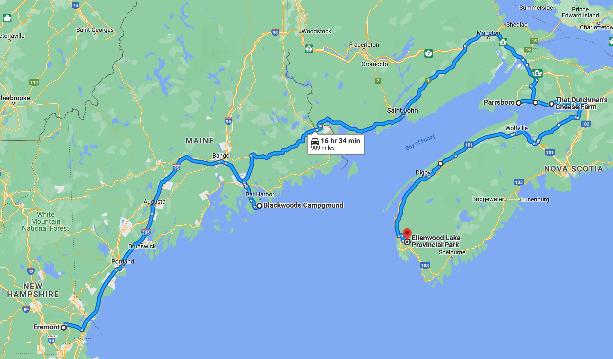

# 🐥  Ellenwood Lake 🐥

#### [<< Previous Post](07-06.md) | [Index](../../README.md) | [Next Post >>](07-08.md)

## Today's Trip

**Date:** Thursday, July 07, 2016

**Starting Point:** Ellenwood Lake Provincial Park, Yarmouth, Nova Scotia, Canada

**Destination:** Ellenwood Lake Provincial Park, Yarmouth, Nova Scotia, Canada

**Distance:** 41 miles

**Photos:** [07/07 Photos](https://jay-d.me/2016RT-07-07)

# 🦉💦 😴  ☕  🔎🌆  🖼  🌊🍎💡  🎪💥  🌯  💤  🥗🥪  🌧💨

## Journal Entry

* As we were waking up, we heard new birds (in addition to the Homer Simpson birds) which we named "orgasm birds". They were so loud. We also barely heard some loons.
* Slept in for a bit, until almost 10! Made coffee and a big batch of oatmeal for breakfast.
* Went into Yarmouth to explore a little. Yarmouth has an app for exploring, so we stopped in at Walmart on our way downtown, but it turns out the app needs constant data and that's something we just can't manage.
* We then headed into Yarmouth proper. It's a cute little port city with a very sleepy downtown. There were lots of old businesses and buildings and a lot of great restaurants ands pubs that we walked by. We're still trying to save up some extra budget, so we didn't stop in.
* We walked along the waterfront and checked out an art gallery before heading to the Yarmouth museum. But it was three dollars per person, and it had started to rain, so instead we hopped in the car to check out the Yarmouth Lighthouse at Cape Forchu.
* It was a very cool "apple core"-style lighthouse with a free museum. The lighthouse had originally shaped like other lighthouses, but was rebuilt in the 60's because of all the weather damage. The museum had a lot of interesting info about lighthouse keepers, the local fishermen and shipwrecks. The lighthouse is on a "false harbor" with a very rocky coast.
* After the lighthouse, we made our way back to camp to find our awning had come down in the wind and rain. 😡 It could have been worse, but some our towels, chairs and bug candle got really wet. Jay fixed the awning, and we set stuff up to dry the best that we could.
* Made lunch - leftover beans in a new burrito and some of Heather's homemade applesauce (yum). We ate in the tent and tried to watch a movie, but our new laptop didn't have DVD software, so we have to wait for internet to download something we can use to watch our DVDs. So, we napped instead.
* For dinner, we made caprese salad sandwiches and soup. Yucky weather, but delicious food. We ate in the tent. On the way to the trash we met a cool, friendly Canadian with a strange, thick accent. He has family in South Weymouth, *of course*.
* It's still raining and very windy out there.

## The Budget

* $-79.00 from previous day
* $60.00 daily addition
* $27.00 expenses
  * $27.00	Campsite
* End of day total: **$-46.00**

## Trip Statistics

* **Total Distance:** 1460 miles
* **Total Budget Spent:** $766.00
* **U.S. States**
  * New Hampshire
  * Maine
* **Canadian Provinces**
  * Nova Scotia
* **National Parks**
  * Acadia

#### [<< Previous Post](07-06.md) | [Index](../../README.md) | [Next Post >>](07-08.md)

