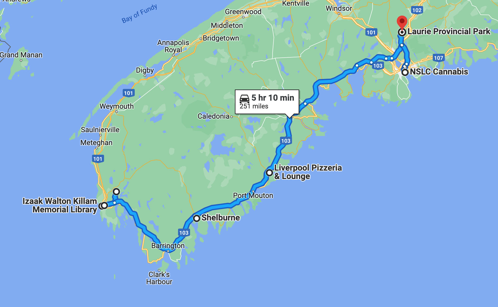

# 🐥  Ellenwood Lake to Laurie 🐿

#### [<< Previous Post](07-07.md) | [Index](../../README.md) | [Next Post >>](07-09.md)

## Today's Trip

**Date:** Friday, July 08, 2016

**Starting Point:** Ellenwood Lake Provincial Park, Yarmouth, Nova Scotia, Canada

**Destination:** Laurie Provincial Park, Grand Lake, Nova Scotia, Canada

**Distance:** 251 miles

## 💧⛺️  📚  🇬🇧  🗣🍕  🚙  ☎️  🚫🧺  🧼  🥃  

## Journal Entry

* We packed up a very wet camp and had some ancient granola bars for breakfast. The awning made it through the night!
* After leaving town, we headed to the library in Yarmouth for some internet.
* Afterwards, we started towards Laurie park. Jay's shoulder has been hurting him, so we stopped at Lawton's Home Health for a hot water bottle.
* Further along the road, we stopped in Shelburne to try and get some pizza. We, maybe more importantly, needed gas as well. This place seemed super-loyalist. There were Union Jacks flying everywhere. Obviously, since they thought they were across the pond, they didn't have any pizza.
* We drove for a bit further before coming across Liverpool. It was still fairly loyalist, but much less vocal about it.
* We ordered a large cheese pizza at Liverpool Pizzeria Ltd. The lady running the joint was super nice! She called Mel terms like "sweet pea", etc. We walked around for a bit while we waited for the pizza.
* When Mel went back in to pick up the pizza, a chatty old man getting a cup of coffee talked with Mel for a bit about black bears. I think?
* On the way back the car, a leather-bound native american asked Mel if she would share the pizza. This place is outgoing!
* Back in the car, we munched on pizza and continued our trek to Laurie. The pizza was good! It was very tomato-ey. We were reminded of some pizza we know somewhere, but couldn't place it. It was crispy; the cheese was a bit burnt. It had a very airy crust.
* The drive became a bit boring after this. There were a couple glimpses of the Atlantic but was mostly trees all the way to Laurie.
* We hit our first traffic jam! At 5pm on a Friday, this should have been expected near Nova Scotia's largest city.
* We finally arrived at the park. It was our first self-registration. We were supposed to call someone using a yellow phone, but the line was busy. We were able to register on our phones using the free Wi-Fi. Mel had to make a call on the yellow phone nonetheless, since we didn't have the security code for the gate.
* There was a self-pay area with ice and wood, so purchased two bags of ice and a bundle.
* We set up camp pretty quickly. Jay was really grumpy because his shoulder hurt him so much. "The Monster", as we started calling it, was fully raging.
* We then went hunting for a laundromat. The park had said they had laundry on-site, but it hadn't been installed yet. We drove around Halifax for a while, but all the laundromats were closed already. Stupid Canada!!! 😡
* So, instead, we decided on booze. We stopped at a super nice NSLC (Nova Scotia Liquor Commission) and bought Dewars and a tall beer (local). The checkout guy has some family in Wakefield. He gave us a "hang ten" hand gesture when we said we were from Boston. He may drive a green Mustang.
* We got back to camp. Jay made a fire, and we used it to heat up some leftover pizza from lunch. It came out a bit smoky.
* Mel had a shower. The bathrooms were great!
* We had some scotch and relaxed. Then bed for a really great night's sleep.

## The Budget

* $39.18 from previous day
* $60.00 daily addition
* $76.03 expenses
  * $32.00	Whiskey & Tall Boy
  * $26.70	Campsite
  * $19.00	Pizza
  * $10.00	Ice & Wood
  * $8.00	Hot Water Bottle
  * $-19.67	Budget Audit
* End of day total: **$23.15**

## Trip Statistics

* **Total Distance:** 1711 miles
* **Total Budget Spent:** $756.85
* **U.S. States**
  * New Hampshire
  * Maine
* **Canadian Provinces**
  * Nova Scotia
* **National Parks**
  * Acadia

#### [<< Previous Post](07-07.md) | [Index](../../README.md) | [Next Post >>](07-09.md)

