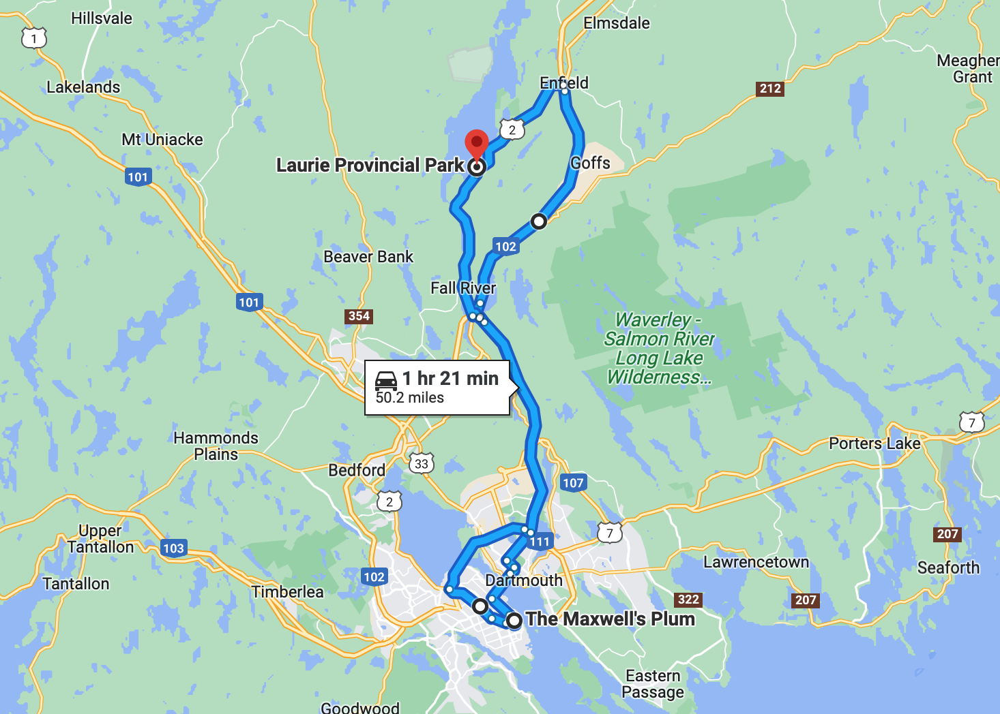
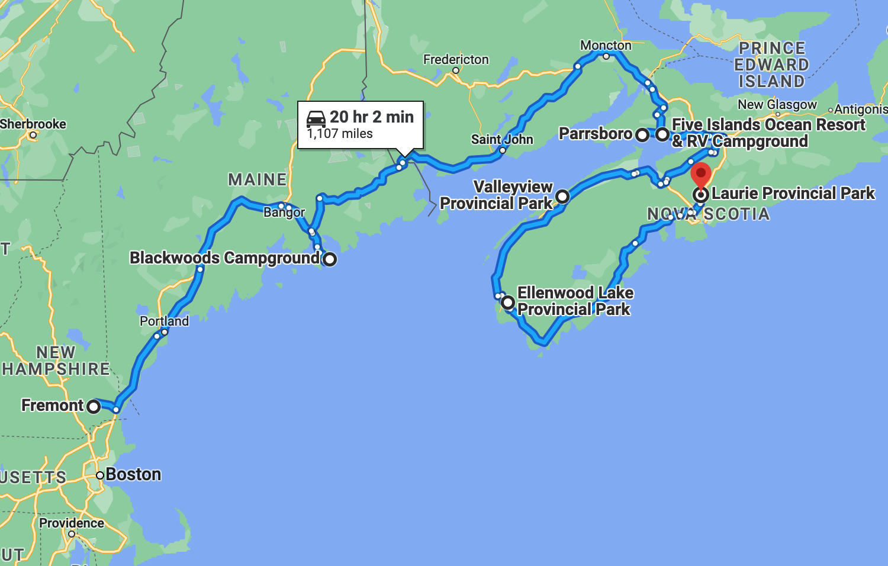

# 🐿  Laurie 🐿

#### [<< Previous Post](https://jay-d.me/2016RT-07-08) | [Index](../../README.md) | [Next Post >>](https://jay-d.me/2016RT-07-10)

## Today's Trip

**Date:** Saturday, July 09, 2016

**Starting Point:** Laurie Provincial Park, Grand Lake, Nova Scotia, Canada

**Destination:** Laurie Provincial Park, Grand Lake, Nova Scotia, Canada

**Distance:** 52 miles

**Photos:** [07/09 Photos](https://jay-d.me/2016RT-07-09-photos)

##  ☕️ • 🚙 • 🅿️ • 🍻 • 🚢 • 🆒🧢 • 🎶 • 🏰 • 🛒 • 🥃 • 🍲 • 🪵🔥

## Journal Entry

* `Journal Entry`
* Woke up after a great night's sleep! Coffee and some leftover oatmeal for breakfast. Got packed up for a day in Halifax.
* We drove into Halifax and found great parking, for free! We walked around a lot and checked out some stores.
* We came across a pub (Maxwell's Plum) that looked really cool, so we stopped in for a beer and some pan nachos. The beer was local and tasted great! The food was good too.
* The place had a great pub vibe and some really awesome happy hour specials, so we might be going back tomorrow. Mel got a black IPA and Jay got a double IPA.
* Then we walked around a bit more to check out the waterfront. There were a lot of really cool ships! We saw a [Theodore Tugboat](https://jay-d.me/teddy-tugboat) (LOL!) and went into a cool souvenir shop that made t-shirts with Nova Scotia logos and brands. We bought a Nova Scotia flag sticker there.
* Oh! There were some kids who walked by us and yelled at us about how cool Jay's (Mel's) hat was!. "That Adidas hat is fucking cool!"
* There was also an awesome clarinetist busking down at the pier. A clarinet busker! Thankfully, he was good!
* After the pier, we walked up to the old town clock and the Halifax citadel. It was a long walk up a steep hill, but there were tremendous views of Halifax. We didn't want to pay to go into the actual citadel, so we stayed in the free bit and learned some history about the citadel and the explosion. Interesting stuff!
* We then walked back to the car and drove back to camp. Along the way, we stopped at Sobey's for some groceries. We got a rotisserie chicken, marshmallows, seltzers, gravy, granola, eggs, maple syrup, etc.
* Back at camp, we relaxed with a scotch and soda after breaking up the rotisserie chicken and marinating it in BBQ sauce.
* For dinner, we had the chicken, some gravy and mashed potatoes. We tried a new beer: Vicar's Cross Double IPA. Yum! Afterwards, we toasted marshmallows over the fire on some limp metal sticks.

## The Budget

* $23.15 from previous day
* $60.00 daily addition
* $125.95 expenses
  * $51.00	Groceries
  * $45.00	Pub - Beer & Nachos
  * $26.70	Campsite
  * $3.25	NS Flag Sticker
* End of day total: **$-42.80**

## Trip Statistics

* **Total Distance:** 1763 miles
* **Total Budget Spent:** $882.80
* **U.S. States**
  * New Hampshire
  * Maine
* **Canadian Provinces**
  * Nova Scotia
* **National Parks**
  * Acadia

#### [<< Previous Post](https://jay-d.me/2016RT-07-08) | [Index](../../README.md) | [Next Post >>](https://jay-d.me/2016RT-07-10)

