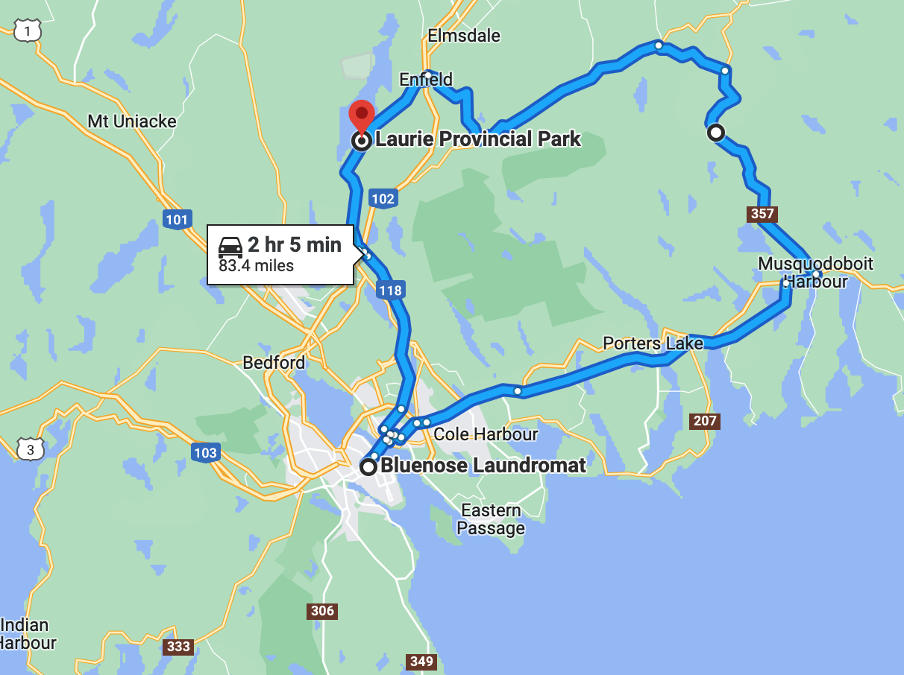

# 🐿  Laurie 🐿

#### [<< Previous Post](https://jay-d.me/2016RT-07-09) | [Index](../../README.md) | [Next Post >>](https://jay-d.me/2016RT-07-11)

## Today's Trip

**Date:** Sunday, July 10, 2016

**Starting Point:** Laurie Provincial Park, Grand Lake, Nova Scotia, Canada

**Destination:** Laurie Provincial Park, Grand Lake, Nova Scotia, Canada

**Distance:** 83 miles

**Photos:** [07/10 Photos](https://jay-d.me/2016RT-07-10-photos)

##  ☕️🍞🍁 • 🐿 • 🍫 • 🧺 • 🍑🍎 • 🍻🦪 • 🌧🚙 • 🌧⛺️ • 🍿🎬 • 🌯 • 🚿🚿

## Journal Entry

* Mel didn't sleep well. The bros next door definitely don't have morning voices.
* We had coffee and French toast(!) with Steeve's maple syrup. Patty Smith would be so proud. Yum!
* Red squirrels are a bunch of dicks. They tried to eat our dirty dishes, and they climbed into our car!
* After breakfast, we cleaned up and headed back into Halifax to do some laundry and a bit more exploring. We took a bunch of wrong turns and almost went over a bridge with a toll. Eventually, we found the laundromat (Bluenose Laundromat).
* We parked on the street and walked to the convenience store to get some cash from the ATM. Broke it with the purchase of a coffee crisp bar. Super yummy! It tastes like a coffee flavored Kit-Kat.
* We did two loads of laundry, and it was pretty great! It was a quiet place with free Wi-Fi and the owners seemed very nice. 10/10, would go back.
* After laundry, we checked out a used book store next door, but all the books seemed pretty pricey.
* Then we went to a liquor store down the street which fills growlers! We filled our new Stanley growler with B*'s "Uprooted" cider. It's made from beets!
* We went downtown again to our favorite restaurant, Maxwell's Plum, and got a pound of mussels for only $2.99! There was only one dead one. What is happy hour without a beer? Jay got another Vicar's Cross and Mel went for an "Uncle Leo" IPA, both Canadian beers.
* We left Halifax and went back to camp. It was raining, so we went the long way hoping the weather would clear before we got back to camp. It did not.
* When we got back to camp, we found we had two new neighbors across the way. They were a couple of French girls who had a really cute and friendly dog. We think he is named Whiskey, but we called him Red.
* Relaxed for a bit at camp, in the tent because of the rain. We made salazar wraps for dinner with the rotisserie chicken from yesterday. Yum! We also had a bit of the beet cider and watched The Life Aquatic with dinner in the tent. It was nice to be able to watch a movie! The rain made it very cozy.
* Later, we showered and finished the movie with a bit more cider before the end of the night.

## The Budget

* $-42.80 from previous day
* $60.00 daily addition
* $77.40 expenses
  * $26.70	Campsite
  * $22.00	Mussels & Beer
  * $19.00	Beet Cider Growler
  * $8.00	Laundry
  * $1.70	Coffee Crisp
* End of day total: **$-60.20**

## Trip Statistics

* **Total Distance:** 1846 miles
* **Total Budget Spent:** $960.20
* **U.S. States**
  * New Hampshire
  * Maine
* **Canadian Provinces**
  * Nova Scotia
* **National Parks**
  * Acadia

#### [<< Previous Post](https://jay-d.me/2016RT-07-09) | [Index](../../README.md) | [Next Post >>](https://jay-d.me/2016RT-07-11)

