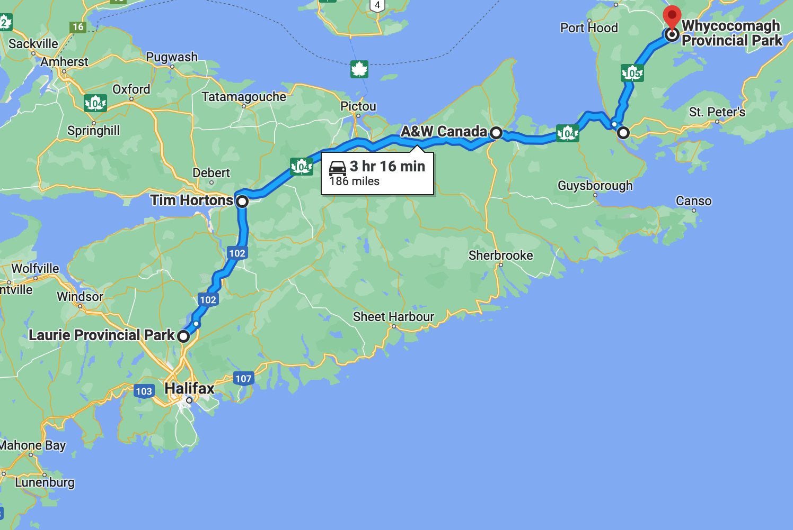
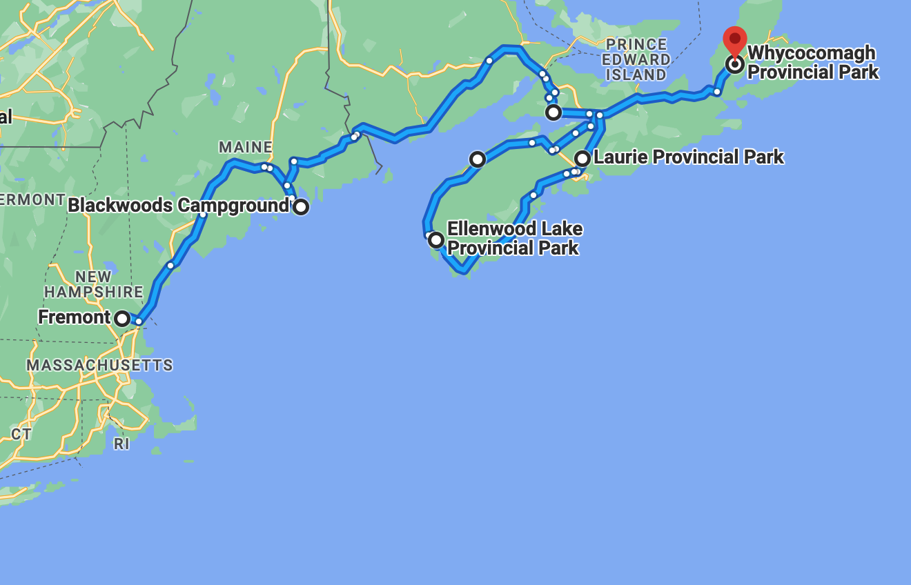

# 🐿  Laurie to Whycocomagh 🗿

#### [<< Previous Post](https://jay-d.me/2016RT-07-10) | [Index](../../README.md) | [Next Post >>](https://jay-d.me/2016RT-07-12)

## Today's Trip

**Date:** Monday, July 11, 2016

**Starting Point:** Laurie Provincial Park, Grand Lake, Nova Scotia, Canada

**Destination:** Whycocomagh Provincial Park, Whycocomagh, Nova Scotia, Canada

**Distance:** 186 miles

**Photo Album** [07/11 Photos](https://jay-d.me/2016RT-07-11-photos)

## 💦⛺️ • 🇨🇦☕️ • 🍔🍔 • 🛒 • 🏕🐈 • 🚶🏻‍♀️🚶🏻️ • 💨🧦 • 🐓🍝 • 🧼 • 📚 • 🍿 •  💻😵

## Journal Entry

* Packed up camp. It was wet, but Jay had a good plan to use the bike tarp to cover up most stuff. The bikes are going to get wet anyway on the back of the car. We packed up and were out of camp by 9:30 (up at 8!) with relatively few issues.
* We stopped at Timmy Ho's for coffee. We tried their hot coffee for the first time, original blend. It's good! Tastes a lot like Dunk's. We also gassed up.
* Realized that Timmy Ho's and Granola bars are the way to go for breakfast on pack-up days. It gets us on the road much faster.
* On the way to Cape Breton, we stopped in Antigonish for lunch at A&W. The McDonald's across the street was *so* fancy and *so* expensive, so we decided to try something new. Jay got the "smoky teen" burger (what a creepy, weird name!) and Mel got the "Chubby Chicken" sandwich. Both were quite tasty and way better than McDonald's.
* This was our first time taking Trrence through a drive through. He nailed it! Also, the McDonald's had poutine!
* We then drove to Port Hawkesbury on Cape Breton to stop at a Sobey's for some groceries.
* Next up was the campground: Whycocomagh Provincial Park. It was another self-registration campground. It was very quiet when we arrived. The lady on the yellow phone picked out a site for us that was relatively quiet and up on a bit of a hill.
* There's a community center, showers, a cooking shelter, laundry, a dishwashing sink and a camp kitty! Mel thinks it's a girl. It's very tiny. There are also yurts for rent.
* Park employees tool around on 4-wheelers all day but there is no one at the front office and no camp host.
* After set up, we went on a walk, where we realized there were so many other sites with better views. Oh well, next time we will drive or walk around a bit first before setting up. There are some hiking trails, but they were very mucky, so we decided to postpone hiking for the day.
* We didn't meet any other campers that first day, but we did meet the park ranger when we bought some wood. He was very nice!
* We had some cider on our lawn and hung up some laundry to dry. We ate some carrots and hummus and had a second drink of scotch and soda.
* We then started preparing our dinner. Chicken pasta, mmmm. We were able to charge up all of our electronics in the clubhouse, so we ate inside the camper with a movie (Inglorious Bastards).
* Afterwards, we went over to the dishwashing sink to do our dishes. We had to wait for a couple of French girls to finish and chatted with them for a bit. Their English was very good. While we waited, we poked around the clubhouse a bit. There were lots of fun, terrible books in a free book basket.
* We *almost* finished our movie. This laptop has some battery issues: the computer died with 45 minutes left in the movie!

## The Budget

* $-60.20 from previous day
* $60.00 daily addition
* $68.71 expenses
  * $26.70	Campsite
  * $19.70	Groceries
  * $13.71	A&W
  * $5.00	Wood
  * $3.60	Tim Horton's
* End of day total: **$-68.91**

## Trip Statistics

* **Total Distance:** 2032 miles
* **Total Budget Spent:** $1028.91
* **U.S. States**
  * New Hampshire
  * Maine
* **Canadian Provinces**
  * Nova Scotia
* **National Parks**
  * Acadia

#### [<< Previous Post](https://jay-d.me/2016RT-07-10) | [Index](../../README.md) | [Next Post >>](https://jay-d.me/2016RT-07-12)

