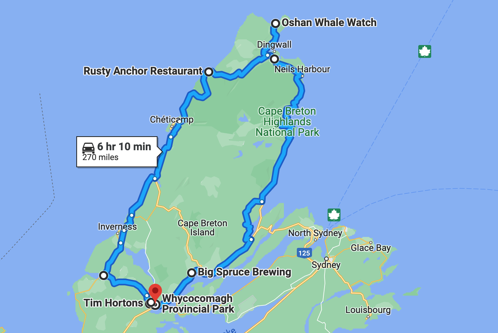
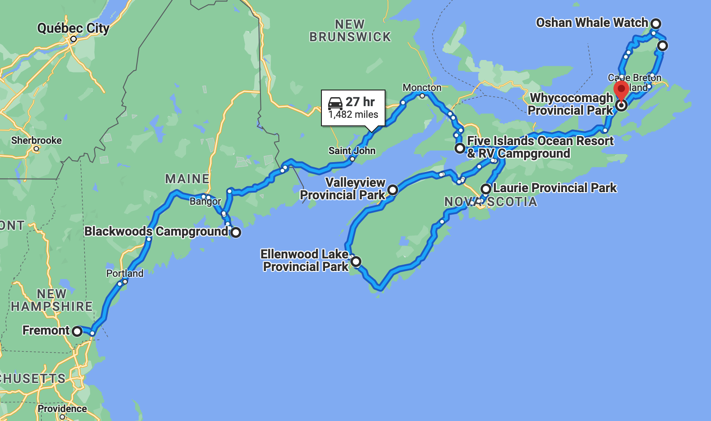

# 🗿  Whycocomagh 🗿

#### [<< Previous Post](https://jay-d.me/2016RT-07-11) | [Index](../../README.md) | [Next Post >>](https://jay-d.me/2016RT-07-13)

## Today's Trip

**Date:** Tuesday, July 12, 2016

**Starting Point:** Whycocomagh Provincial Park, Whycocomagh, Nova Scotia, Canada

**Destination:** Whycocomagh Provincial Park, Whycocomagh, Nova Scotia, Canada

**Distance:** 270 miles

**Photos:** [07/12 Photos](https://jay-d.me/2016RT-07-12-photos)

## ☕️️ • 🚙⛰️ • 🏴󠁧󠁢󠁳󠁣󠁴󠁿 • 🐟🛥 • ⚓️🦪 • 😴🪵🧚🏼‍♀️ • 🌲 • 👨‍👩‍👧‍👦🍫 • 🔥

## Journal Entry

* We woke up **super** early (7am) to hit the Cabot Trail. We stopped at a Tim Horton's for coffee and had a granola bar for breakfast. We also gassed up, as this was going to be a long day of driving.
* We drove to the beginning of the Cabot trail, planning on a counter-clockwise route. It started out a little boring, but as we climbed the mountains, we were met with stunning views of the ocean. "Where the mountains meet the sea." There were lots of winding mountain roads which lead you to great "look-offs" of the ocean or the valleys below. Justin from [The Shire](https://jay-d.me/2016RT-07-01) had said this journey was life-changing. We're not ready to go that far, but the views *were* breathtaking.
* We stopped at a cool Celtic heritage shop called Tartans & Treasures. Here Mel learned a bit of history about the Grahams and found some tartans with her clan's colors as well as all sorts of memorabilia with her clan's crest. Very cool! She wasn't sure if she was a Graham of Montrose or a Graham of Monteith, but later was able to confirm with her sister Heather that they are of the clan Monteith. Everything at this little shop was very expensive, however, so we didn't buy anything this time around.
* Next we entered Cape Breton Highlands National Park. The park has lots of hiking and other activities, but were just there to drive the Cabot Trail. Perhaps we'll be back some day for some hiking or kayaking.
* Mel was getting very sleepy and was having trouble staying awake, but making a detour to see the tip of Cape Breton perked her up a bit. At the northern end, we found a very cute little town called Bay St. Lawrence. It was right on the gulf of the same name. There were lots of fishing boats in the Harbor. 
* Halfway through the trail, we stopped at the Rusty Anchor restaurant. It was an amazing spot, right on the water with gorgeous views. After some hemming and hawing, we decided on 1/2 dozen raw oysters (delicious, mild and just the right amount of brine) and two cups of clam chowder. We also each had a Propeller ESB. It was all so delicious.
* We finished up the trail and headed back to camp for a nap. The nice park guy turned into the wood fairy and dropped off some extra wood while we were sleeping!
* We woke from our nap and went to Big Spruce Brewing, down the street from the campground. This is where the Black IPA that Mel had at Maxwell's Plum was brewed. They're a cute, organic brewery up on a hill overlooking the nearby lake. They collect growlers from all over. Figuring that we could easily get another Tributary growler, we traded ours in for a Big Spruce growler. We filled up our new growler with their Red IPA. We'd love to go back for a tasting some day.
* On the way back to camp, we stopped at the co-op for crackers and ice. The Farmer's Daughter didn't have very much to choose from.
* Back at camp, we met our neighbors at the next site over. They came over to discuss our camper. So nice! They're a family from Toronto on a 34-day camping trip. They are cute and sing songs around the fire together. Tara was the mom. Dad plays guitar with the kids, including a David Bowie song!
* We ate some cheese spread from the Dutchman and some crackers as snacks with our beer. Jay made a fire while Mel prepped dinner. We had roasted veggies and corn in a wrap with hummus and some of the cheese spread. It was so good!
* Later, Tara came over with some Cadbury chocolate as a thank you for answering all her questions about our camper. We enjoyed her questions, but we weren't go to turn down some delicious chocolate!
* After dinner and dishes we hung out around the fire until bed time.

## The Budget

* $-68.91 from previous day
* $60.00 daily addition
* $121.20 expenses
  * $55.50	The Rusty Anchor
  * $26.70	Campsite
  * $19.00	Growler @ Big Spruce
  * $15.80	Park Access
  * $4.20	Tim Horton's
* End of day total: **$-130.11**

## Trip Statistics

* **Total Distance:** 2302 miles
* **Total Budget Spent:** $1150.11
* **U.S. States**
  * New Hampshire
  * Maine
* **Canadian Provinces**
  * Nova Scotia
* **National Parks**
  * Acadia

#### [<< Previous Post](https://jay-d.me/2016RT-07-11) | [Index](../../README.md) | [Next Post >>](https://jay-d.me/2016RT-07-13)

